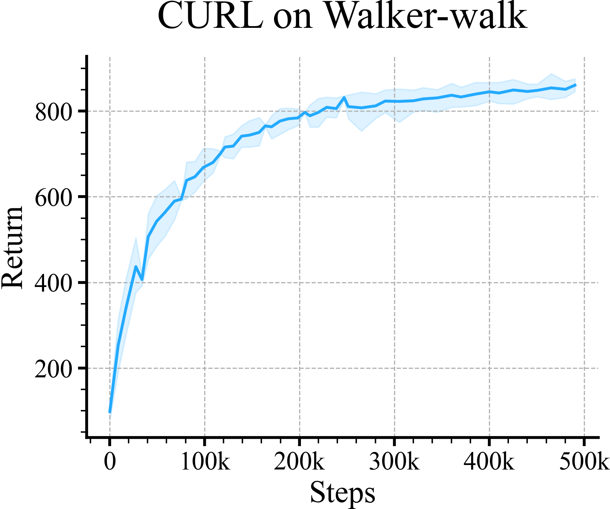

# Loading and Plotting A Single Learning Curve

Here is a simple example, showing how to load a single learning curve with
95% confidence range using `logger.read_metrics` call.

The plotting code is minimal to keep it simple.

Initialize the loader
```python
loader = ML_Logger(root=os.getcwd(), prefix="data/walker-walk/curl")
```
Check all the files
```python
files = loader.glob(query="**/metrics.pkl", wd=".", recursive=True)
doc.print(files)
```

```
['300/metrics.pkl', '400/metrics.pkl', '100/metrics.pkl', '200/metrics.pkl']
```
Step 1: load the data
```python
avg, top, bottom, step = loader.read_metrics("train/episode_reward/mean@mean",
                                             "train/episode_reward/mean@84%",
                                             "train/episode_reward/mean@16%",
                                             x_key="step@mean",
                                             path="**/metrics.pkl",
                                             bin_size=40)
```
Step 2: Plot
```python
title = "CURL on Walker-walk"

plt.figure()

plt.plot(step, avg.to_list())
plt.fill_between(step, bottom, top, alpha=0.15)
plt.gca().xaxis.set_major_formatter(ticker.FuncFormatter(lambda x, _: f"{int(x/1000)}k" if x else "0"))
plt.title(title)
plt.xlabel("Steps")
plt.ylabel("Return")

r.savefig(f"figures/learning_curve.png", title=title, dpi=300, zoom="20%")
```

| **CURL on Walker-walk** |
|:-----------------------:|
|  |
