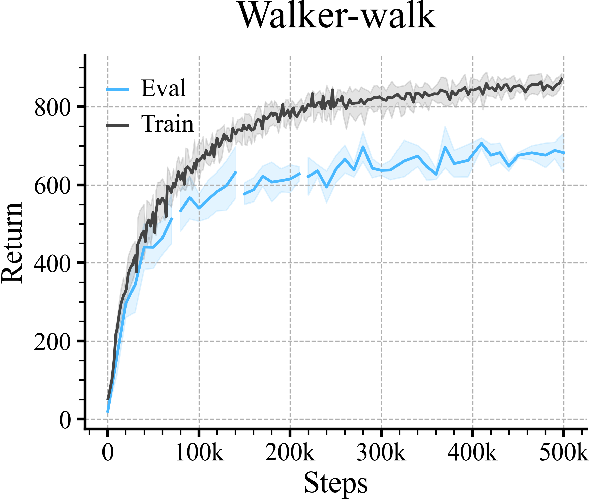

# 2. Comparing Two Learning Curves Side-by-side

Here we compare the training performance versus the performance 
on the evaluation domain.

We show the training performance in gray, to accentuate the 
evaluation curve.

Initialize the loader
```python
loader = ML_Logger(prefix="data/walker-walk/curl")
```
Check all the files
```python
files = loader.glob(query="**/metrics.pkl", wd=".", recursive=True)
doc.print(files)
```

```
['300/metrics.pkl', '400/metrics.pkl', '100/metrics.pkl', '200/metrics.pkl']
```
A Single Time Series
```python
def group(xKey="step", yKey="train/episode_reward/mean", color=None, bins=40, label=None):
    if bins:
        bins = BinOptions(key=xKey, size=bins)
    step, avg, top, bottom = loader.read_metrics(xKey, yKey, yKey + "@95%", yKey + "@5%",
                                                 path="**/metrics.pkl", bin=bins)
    plt.plot(step.to_list(), avg.to_list(), color=color, label=label)
    plt.fill_between(step, bottom, top, alpha=0.15, color=color)
```
Step 2: Plot
```python
colors = ['#49b8ff', '#444444', '#ff7575', '#66c56c', '#f4b247']

plt.figure(figsize=(3, 2))

group(yKey="episode_reward/mean", color=colors[0], bins=None, label="Eval")
group(yKey="train/episode_reward/mean", color=colors[1], label="Train")
plt.legend(frameon=False)

r.savefig(f"figures/train_vs_eval.png", title="Train VS Eval", dpi=300)
```

| **Train VS Eval** |
|:-----------------:|
|  |
