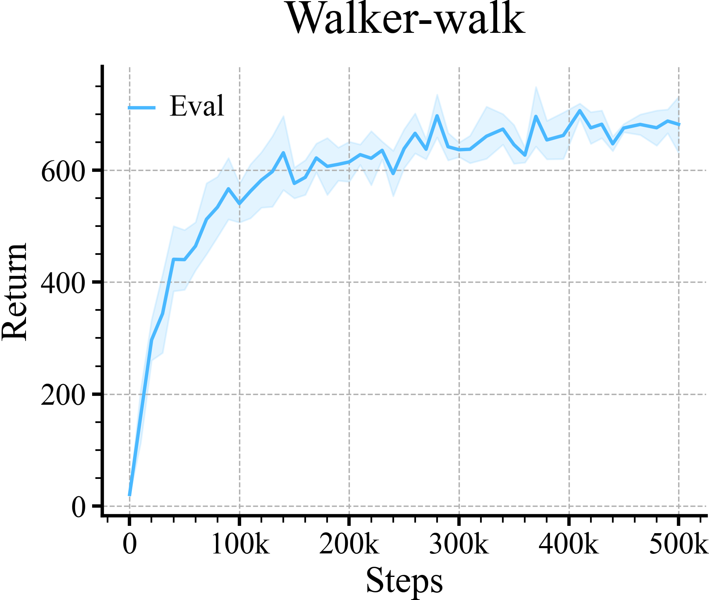

# Comparing Two Learning Curves Side-by-side

Here we compare the training performance versus the performance 
on the evaluation domain.

We show the training performance in gray, to accentuate the 
evaluation curve.

Initialize the loader
```python
loader = ML_Logger(root=os.getcwd(), prefix="data/walker-walk/curl")
```
Check all the files
```python
files = loader.glob(query="**/metrics.pkl", wd=".", recursive=True)
doc.print(files)
```

```
['300/metrics.pkl', '400/metrics.pkl', '100/metrics.pkl', '200/metrics.pkl']
```
A Single Time Series
```python
def group(xKey="step", yKey="train/episode_reward/mean", color=None, bin=10, label=None, dropna=False):
    avg, top, bottom, step = loader.read_metrics(f"{yKey}@mean", f"{yKey}@84%", f"{yKey}@16%", x_key=f"{xKey}@mean",
                                                 path="**/metrics.pkl", bin_size=bin, dropna=dropna)
    plt.plot(step, avg, color=color, label=label)
    plt.fill_between(step, bottom, top, alpha=0.15, color=color)
    return avg
```
Step 2: Plot
```python
colors = ['#49b8ff', '#444444', '#ff7575', '#66c56c', '#f4b247']

avg = group(yKey="episode_reward/mean", bin=None, color=colors[0], label="Eval")
group(yKey="train/episode_reward/mean", color=colors[1], label="Train")

plt.gca().xaxis.set_major_formatter(ticker.FuncFormatter(lambda x, _: f"{int(x / 1000)}k" if x else "0"))
plt.legend()
plt.title("Walker-walk")
plt.xlabel("Steps")
plt.ylabel("Return")

r.savefig(f"figures/train_vs_eval.png", title="Train VS Eval", dpi=300, zoom="20%")
plt.close()
```

| **Train VS Eval** |
|:-----------------:|
|  |

## Where does the empty cuts come from? 

These cuts are places where the `avg` is `NaN`. You can just filter this out 
in the `group` function.

```python
doc.print(avg)
```

```
step
(-0.001, 5098.039]           20.341932
(5098.039, 10196.078]       159.512312
(10196.078, 20000.0]        296.704378
(20000.0, 30000.0]          343.709928
(30000.0, 40000.0]          440.871364
(40000.0, 50000.0]          440.290806
(50000.0, 60000.0]          464.523289
(60000.0, 70000.0]          512.451430
(70000.0, 75882.353]               NaN
(75882.353, 80980.392]      534.083886
(80980.392, 90000.0]        566.964033
(90000.0, 100000.0]         540.526823
(100000.0, 110000.0]        562.481581
(110000.0, 120000.0]        582.455365
(120000.0, 130000.0]        597.723035
(130000.0, 140000.0]        631.353935
(140000.0, 146666.667]             NaN
(146666.667, 151764.706]    576.559410
(151764.706, 160000.0]      587.484037
(160000.0, 170000.0]        622.087906
(170000.0, 180000.0]        607.022307
(180000.0, 190000.0]        610.693518
(190000.0, 200000.0]        614.979733
(200000.0, 210000.0]        627.987848
(210000.0, 217450.98]              NaN
(217450.98, 222549.02]      621.534480
(222549.02, 230000.0]       635.705141
(230000.0, 240000.0]        594.198112
(240000.0, 250000.0]        638.786110
(250000.0, 260000.0]        666.134860
(260000.0, 270000.0]        637.613542
(270000.0, 280000.0]        697.436256
(280000.0, 290000.0]        642.128056
(290000.0, 303333.333]      636.789103
(303333.333, 318431.373]    637.653942
(318431.373, 330000.0]      660.905099
(330000.0, 340000.0]        673.678899
(340000.0, 350000.0]        645.906549
(350000.0, 360000.0]        627.167255
(360000.0, 373921.569]      696.372121
(373921.569, 389019.608]    654.296411
(389019.608, 400000.0]      662.388210
(400000.0, 410000.0]        706.604360
(410000.0, 420000.0]        675.908748
(420000.0, 430000.0]        682.392554
(430000.0, 444509.804]      647.357963
(444509.804, 459607.843]    675.610188
(459607.843, 470000.0]      682.014805
(470000.0, 480000.0]        676.036846
(480000.0, 490000.0]        688.063507
(490000.0, 500000.0]        682.238766
Name: episode_reward/mean@mean, dtype: float64
```
```python
avg = group(yKey="episode_reward/mean", bin=None, color=colors[0], label="Eval", dropna=True)

plt.gca().xaxis.set_major_formatter(ticker.FuncFormatter(lambda x, _: f"{int(x / 1000)}k" if x else "0"))
plt.legend()
plt.title("Walker-walk")
plt.xlabel("Steps")
plt.ylabel("Return")

r.savefig(f"figures/train_vs_eval_dropna.png", title="Train VS Eval", dpi=300, zoom="20%")
```

| **Train VS Eval** |
|:-----------------:|
|  |
