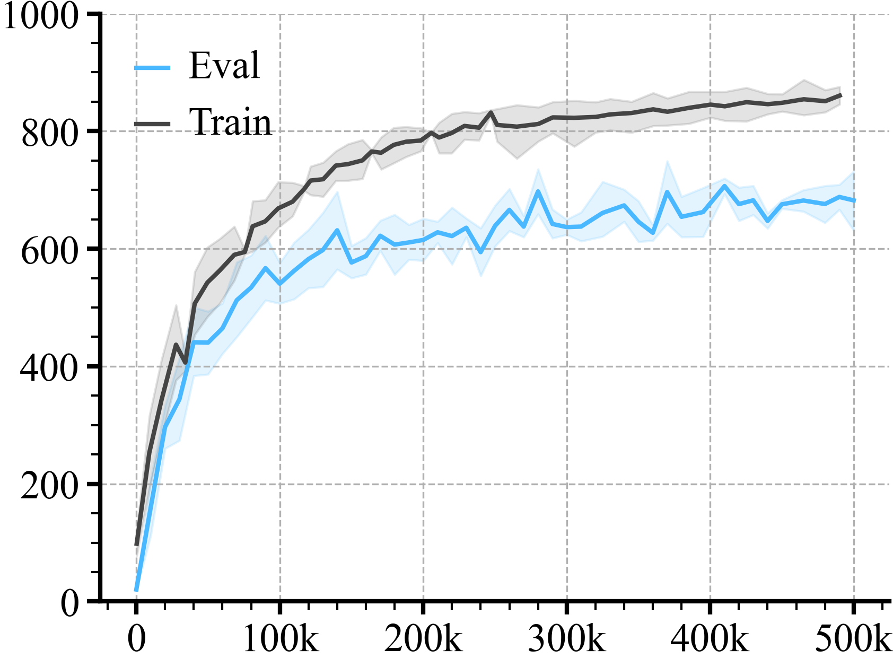
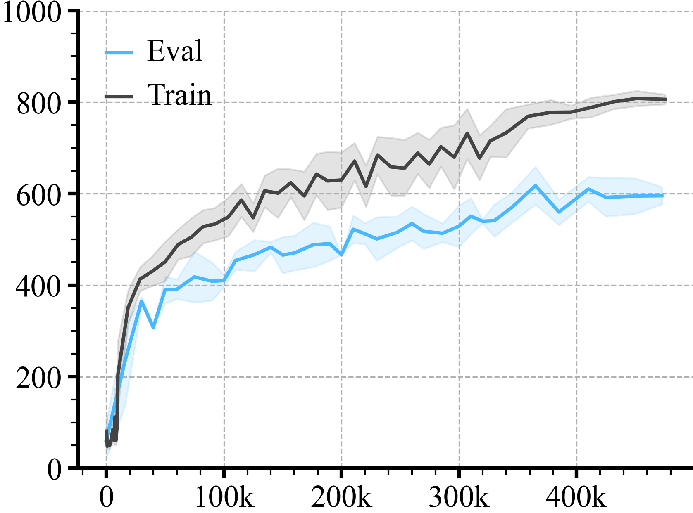
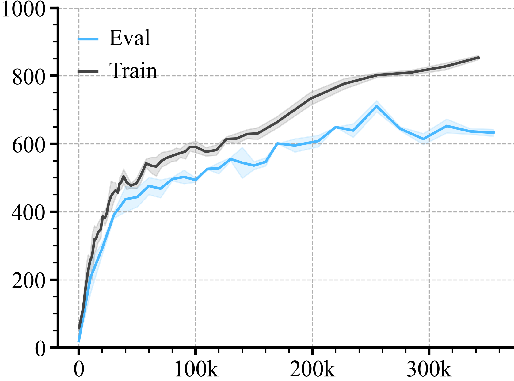
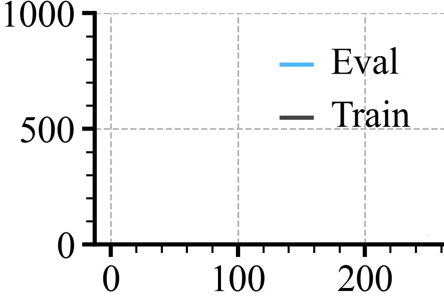

# Facet and Grouping

Here we show the learning curve from multiple methods, on the same domain.

We typically arrange the data with a folder structure `f"{domain}/{method}/{seed}"`.

Initialize the loader
```python
loader = ML_Logger(root=os.getcwd(), prefix="data/walker-walk")
```
Check all the files
```python
files = loader.glob(query="**/metrics.pkl", wd=".", recursive=True)
doc.print(files)
```

```
['soda/300/metrics.pkl', 'soda/400/metrics.pkl', 'soda/100/metrics.pkl', 'soda/200/metrics.pkl', 'pad/300/metrics.pkl', 'pad/400/metrics.pkl', 'pad/100/metrics.pkl', 'pad/200/metrics.pkl', 'curl/300/metrics.pkl', 'curl/400/metrics.pkl', 'curl/100/metrics.pkl', 'curl/200/metrics.pkl', 'rad/300/metrics.pkl', 'rad/400/metrics.pkl', 'rad/100/metrics.pkl', 'rad/200/metrics.pkl']
```
Plotting A Single Time Series
```python
def group(xKey="step", yKey="train/episode_reward/mean", color=None, bin=10, label=None, dropna=False):
    avg, top, bottom, step = loader.read_metrics(f"{yKey}@mean", f"{yKey}@84%", f"{yKey}@16%", x_key=f"{xKey}@mean",
                                                 path="**/metrics.pkl", bin_size=bin, dropna=dropna)
    plt.plot(step, avg, color=color, label=label)
    plt.fill_between(step, bottom, top, alpha=0.15, color=color)
    return avg
```
Step 2: Plot
```python
title = "CURL"
colors = ['#49b8ff', '#444444', '#ff7575', '#66c56c', '#f4b247']

for method in ['curl', 'rad', 'pad', 'soda']:
    plt.figure(figsize=(3, 2))

    with loader.Prefix(method):
        group(yKey="episode_reward/mean", color=colors[0], bin=None, label="Eval")
        group(yKey="train/episode_reward/mean", color=colors[1], label="Train")
        plt.legend(frameon=False)
        plt.ylim(0, 1000)

    r.savefig(f"figures/{method}/train_vs_eval.png", title=method.capitalize(), dpi=300)
```

| **Curl** | **Rad** | **Pad** | **Soda** |
|:--------:|:-------:|:-------:|:--------:|
|  |  |  |  |
