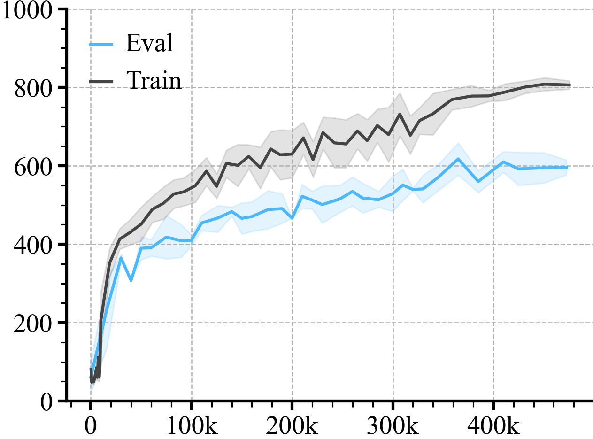
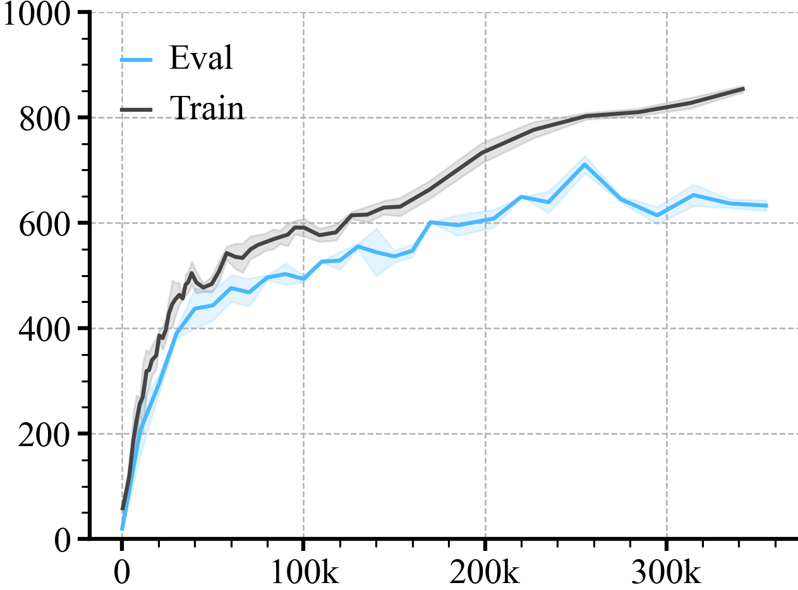
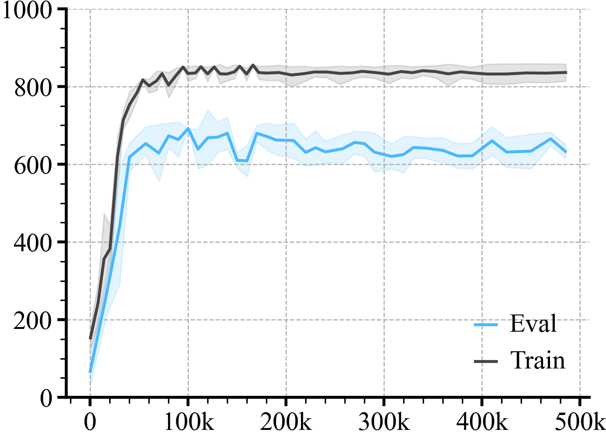
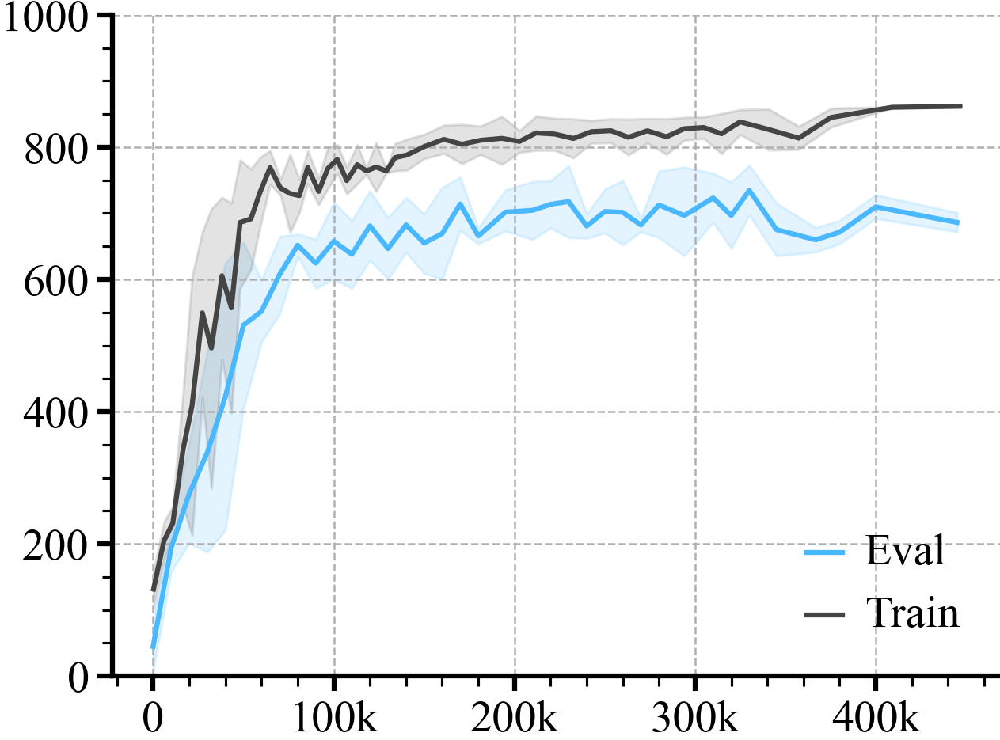
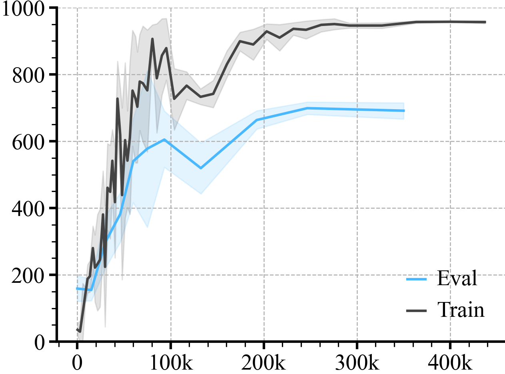
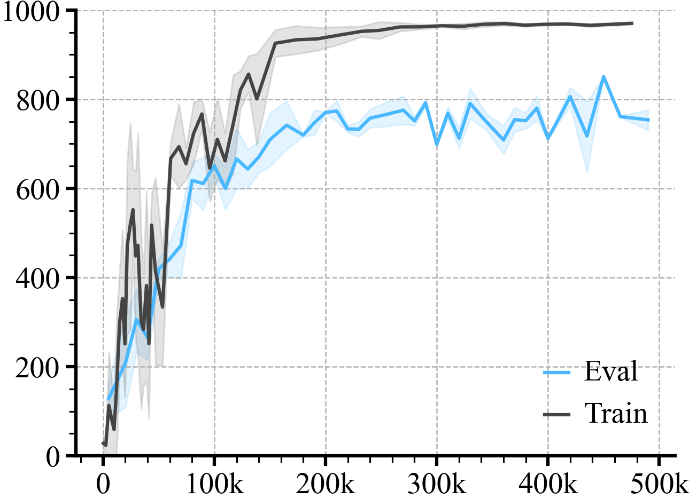
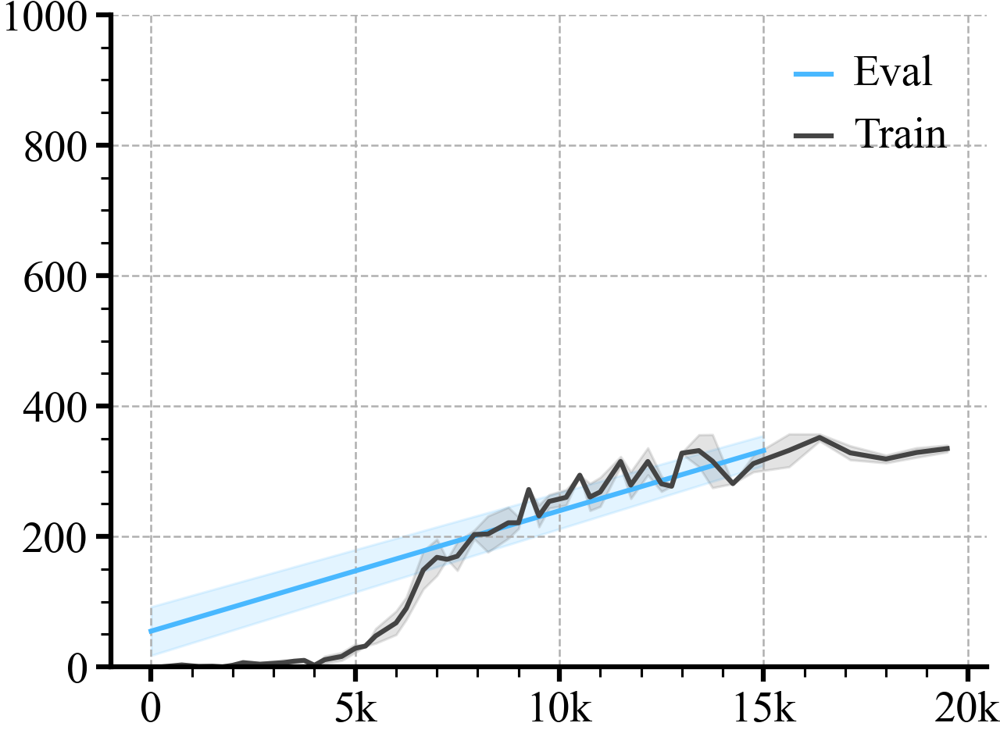

# Results Over All Domains


Initialize the loader
```python
loader = ML_Logger(root=os.getcwd(), prefix="data")
```
Check all the files
```python
files = loader.glob(query="**/metrics.pkl", wd=".", recursive=True)
```
Plotting A Single Time Series
```python
def group(xKey="step", yKey="train/episode_reward/mean", color=None, bins=50, label=None, dropna=False):
    avg, top, bottom, step = loader.read_metrics(f"{yKey}@mean", f"{yKey}@84%", f"{yKey}@16%", x_key=f"{xKey}@mean",
                                                 path="**/metrics.pkl", num_bins=bins, dropna=dropna)
    plt.plot(step, avg, color=color, label=label)
    plt.fill_between(step, bottom, top, alpha=0.15, color=color)
```
Step 2: Plot
```python
title = "CURL"
colors = ['#49b8ff', '#444444', '#ff7575', '#66c56c', '#f4b247']

for domain in ['walker-walk', 'cartpole-swingup', 'ball_in_cup-catch', 'finger-spin']:
    name, task = domain.split("-")

    doc(name.replace('_', ' ').title(), f"[{task}]")
    with loader.Prefix(domain), doc.table().figure_row() as r:
        for method in ['curl', 'rad', 'pad']:
            with loader.Prefix(method):
                group(yKey="episode_reward/mean", bins=None, dropna=True, color=colors[0],
                      label="Eval")
                group(yKey="train/episode_reward/mean", color=colors[1], label="Train")

            plt.legend(frameon=False)
            plt.ylim(0, 1000)
            plt.gca().xaxis.set_major_formatter(ticker.FuncFormatter(lambda x, _: f"{int(x / 1000)}k" if x else "0"))
            r.savefig(f"figures/{name}/{method}/train_vs_eval.png", title=method.capitalize())
            plt.close()
```

Walker [walk]
| **Curl** | **Rad** | **Pad** |
|:--------:|:-------:|:-------:|
|  |  |  |

Cartpole [swingup]
| **Curl** | **Rad** | **Pad** |
|:--------:|:-------:|:-------:|
|  |  |  |

Ball In Cup [catch]
| **Curl** | **Rad** | **Pad** |
|:--------:|:-------:|:-------:|
|  |  |  |

Finger [spin]
| **Curl** | **Rad** | **Pad** |
|:--------:|:-------:|:-------:|
|  |  |  |
