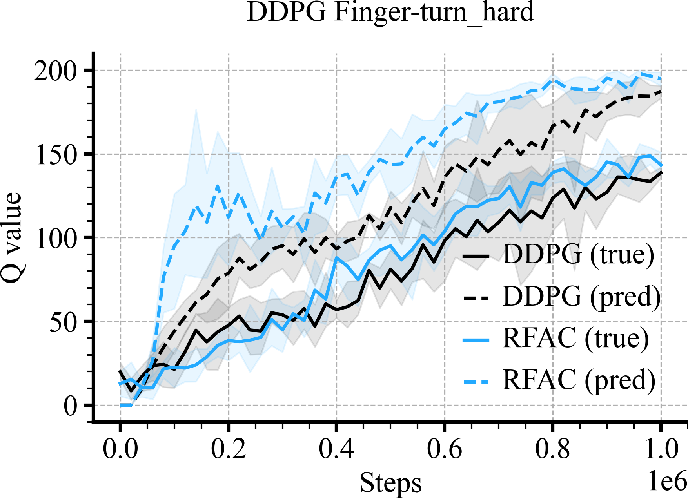

# MUJOCO Comparisons
```python
loader = ML_Logger(prefix="model-free/model-free/rff_post_iclr/dmc/drqv2/4_layer")
print(loader)
```
```python
def plot_line(path, color, label):
    print(path)
    mean, low, high, step, = loader.read_metrics("eval/avg_true_q/mean@mean",
                                                 "eval/avg_true_q/mean@16%",
                                                 "eval/avg_true_q/mean@84%",
                                                 x_key="frames@min", path=path)
    plt.xlabel('Steps', fontsize=18)
    plt.ylabel('Q value', fontsize=18)

    plt.plot(step.to_list(), mean.to_list(), color=color, label=f'{label} (true)')
    plt.fill_between(step, low, high, alpha=0.1, color=color)

    mean, low, high, step, = loader.read_metrics("eval/avg_pred_q/mean@mean",
                                                 "eval/avg_pred_q/mean@16%",
                                                 "eval/avg_pred_q/mean@84%",
                                                 x_key="frames@min", path=path)

    plt.plot(step.to_list(), mean.to_list(), color=color, label=f'{label} (pred)', linestyle='--')
    plt.fill_between(step, low, high, alpha=0.1, color=color)
```
Drqv2 (state) -RFF vs Drqv2
```python
for (b_val, env_name) in tqdm(zip(b_vals, envs), desc="(b_val, env)"):

    if loader.every(4, 'figure', start_on=1):
        r = doc.table().figure_row()

    if env_name == 'dmc:Finger-turn_hard-v1':
        menv = 'dmc:Finger-turn_hard2-v1'
    else:
        menv = env_name

    plt.title(f"DDPG {env_name.split(':')[-1][:-3]}", fontsize=18)
    plot_line(path=f"mlp/{menv.split(':')[-1][:-3]}/**/metrics.pkl", color='black', label='DDPG')

    if env_name == 'dmc:Humanoid-run-v1':
        tenv = 'dmc:Humanoid-run2-v1'
    else:
        tenv = env_name

    plot_line(path=f"rff_mean_std_full/rff/iso/b-{b_val}/{tenv.split(':')[-1][:-3]}/**/metrics.pkl",
              color=colors[0], label=f'RFAC')

    plt.legend()
    plt.tight_layout()
    r.savefig(f'{os.path.basename(__file__)[:-3]}/{env_name}.png', dpi=300, zoom=0.3)
    plt.close()
```

|  |  |  |  |
|:-----------------------------------------------------------------------------------------------------------------------------------------------------------------------------------:|:---------------------------------------------------------------------------------------------------------------------------------------------------------------------------------:|:----------------------------------------------------------------------------------------------------------------------------------------------------------------------------------:|:--------------------------------------------------------------------------------------------------------------------------------------------------------------------------------:|

|  |  |  |  |
|:------------------------------------------------------------------------------------------------------------------------------------------------------------------------------------:|:------------------------------------------------------------------------------------------------------------------------------------------------------------------------------:|:-------------------------------------------------------------------------------------------------------------------------------------------------------------------------------:|:------------------------------------------------------------------------------------------------------------------------------------------------------------------------------:|
